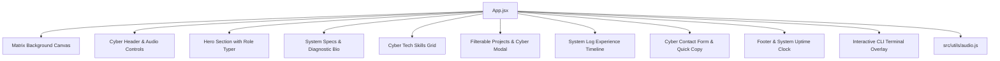

# ⚡ Cyberpunk Tech Portfolio - Repository Handoff

**Project Root**: `C:\Users\rapik\Desktop\PENTING\projects\tester`  
**Date**: 2026-08-08  
**Status**: Alignment Complete & Specification Approved — Scaffolding & Core Data Initialized

---

## 🎯 1. Project Overview & Vision

A high-performance, visually stunning **Cyberpunk Tech Portfolio** built with **Vite + React 18** and pure **Vanilla CSS**. The application is designed to impress recruiters and visitors with futuristic high-tech aesthetics, dark void backgrounds, glowing neon accents, matrix grid canvas animations, synthetic Web Audio sound effects, an interactive CLI terminal overlay, and modular static data management.

### Tech Stack
- **Framework**: Vite + React 18 (SPA)
- **Styling**: Vanilla CSS3 (`src/index.css`) with CSS Variables, Flexbox/Grid, Glassmorphism backdrop filters, and keyframe animations
- **Typography**: Google Fonts — `Orbitron` (Cyber titles), `Fira Code` (Terminal & code), `Inter` (Body text)
- **Icons**: Lucide React (`lucide-react`)
- **Audio Engine**: Synthetic browser Web Audio API oscillator synthesizer (`src/utils/audio.js`)

---

## 📁 2. Current Codebase State

The repository has been scaffolded and the foundational configuration files have been created:

```
tester/
├── index.html                   # Configured with Google Fonts (Orbitron, Fira Code, Inter) & meta tags
├── package.json                 # React + Vite + lucide-react dependencies
├── HANDOFF.md                   # This project handoff document
└── src/
    ├── main.jsx                 # Application entry point
    ├── index.css                # Cyberpunk design system tokens, glow effects & card glassmorphism
    ├── data/
    │   └── portfolioData.js     # Centralized static portfolio data store (Profile, Specs, Skills, Projects, Logs, Socials)
    └── utils/
        └── audio.js             # Zero-dependency Web Audio API sound synthesizer engine (Click, Keypress, Modal, Success)
```

---

## 📐 3. Architecture & Component Blueprint



---

## 🎟️ 4. Vertical-Slice Execution Tickets

Work has been decomposed into 8 tracer-bullet vertical slices:

| Ticket # | Title | Blocked By | Key Deliverables |
| :--- | :--- | :--- | :--- |
| **01** | **Core Cyber Design System & Shell Layout** | *None* | `index.css`, `MatrixBackground.jsx`, `Navbar.jsx` with CRT scanlines & smooth section scrolling. |
| **02** | **Synthetic Audio Engine Integration** | Ticket 01 | Audio mute toggle button in Navbar & interactive sound FX on click/hover. |
| **03** | **Hero Section & System Specs (About)** | Ticket 01 | Avatar frame with status ring, dynamic role typer, diagnostic stats card. |
| **04** | **Interactive Skills Grid & Progress Bars** | Ticket 01 | Skill breakdown (Frontend, Backend, DevOps/Security) with tech icons & glowing animated progress bars. |
| **05** | **Filterable Projects Showcase & Cyber Modal** | Ticket 01 | Tech category filter tabs (ALL, FULLSTACK, FRONTEND, BACKEND, AI/CYBER), holographic cards, detail modal viewer. |
| **06** | **Experience Timeline Logs & Contact Form** | Ticket 01 | System log timeline, contact form with input validation, copy social handle/email actions, uptime counter. |
| **07** | **Interactive CLI Terminal Overlay** | Ticket 01, 05, 06 | Command-line popup (`Ctrl+K` / navbar button) supporting `help`, `bio`, `skills`, `projects`, `contact`, `clear`. |
| **08** | **E2E Integration & Production Build** | Ticket 02-07 | Verify static data updates, zero console warnings/errors, clean `npm run build` execution. |

---

## 🛠️ 5. Suggested Skills & Guidance for Next Agent

- **`to-tickets`**: Invoke this skill to publish the 8 tickets as local markdown issue files under `.scratch/cyberpunk-portfolio/issues/01-...md` to `08-...md`.
- **`web_application_development`**: Follow the visual excellence guidelines for React + CSS building (rich dark aesthetics, glassmorphism, dynamic hover states).

---

## 🚀 6. Next Steps for Next Session

1. Run `/to-tickets` to generate local issue files under `.scratch/cyberpunk-portfolio/issues/`.
2. Implement **Ticket 01** (`src/components/MatrixBackground.jsx`, `src/components/Navbar.jsx`, `src/App.jsx`).
3. Sequentially build remaining section components (`Hero.jsx`, `About.jsx`, `Skills.jsx`, `Projects.jsx`, `Experience.jsx`, `Contact.jsx`, `CLITerminal.jsx`).
4. Execute `npm run build` and `npm run dev` to verify complete interactive functionality.
